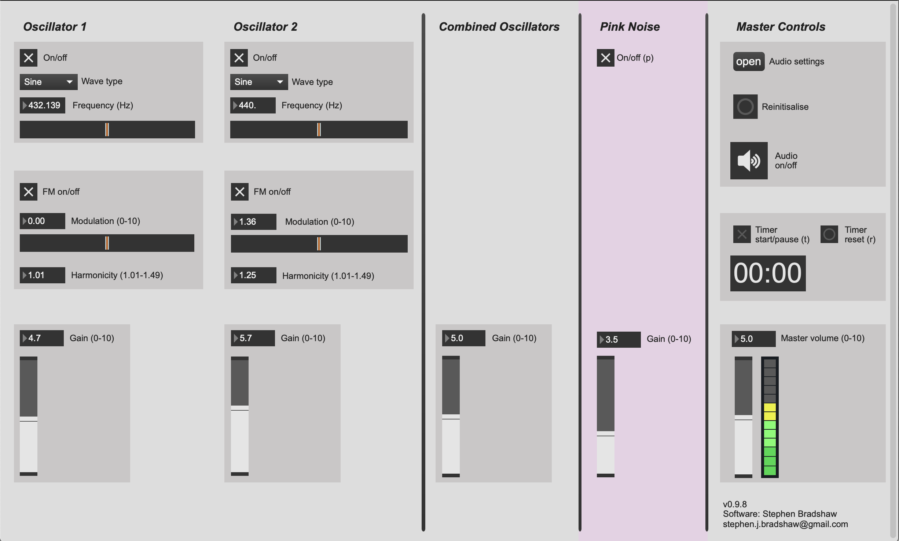

# Deeply Doppling

This Max patch was developed to specification for sound artist [Shaun Davies](https://www.shaundavies.info/about) for his piece [_Deeply Doppling_](https://www.shaundavies.info/deeply-doppling).

The brief was for an easy-to-use synthesizer app that several performers could download and run on their laptops. Very fine, continuous control of pitch and FM modulation were required. To achieve this, I implemented a 'rubber-band-style' slider UI element to provide intuitive control. Watch the [demo](https://youtu.be/S9B7SCF8LSg) to see this in action.

A standalone application for MacOS is available under [releases](https://github.com/stephenjbradshaw/deeply-doppling/releases). If you have any questions, don't hesitate to [get in touch](mailto:hello@stephenbradshaw.dev).

## Features

- Two oscillators with 'rubber-band' controls for pitch
- FM synth capability on each oscillator, with 'rubber-band' controls for modulation
- Pink noise generator
- Gain controls for each sound source
- Built-in timer, to aid in following the artist's score

## Future development

For future versions of the piece, the patch could be rewritten as a web application, removing the need for performers to install software.

## UI screenshot

## Prerequisites

To run or edit : [Max 8](https://cycling74.com/downloads)

## Author

**Stephen Bradshaw** – [Portfolio](https://www.stephenbradshaw.dev) | [Linkedin](https://www.linkedin.com/in/stephenbradshawdev/) | [Github](https://github.com/stephenjbradshaw)
